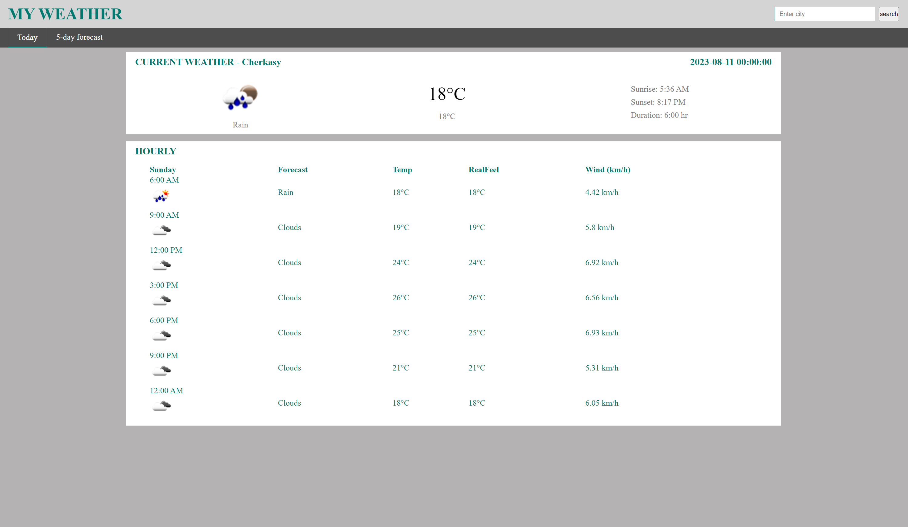
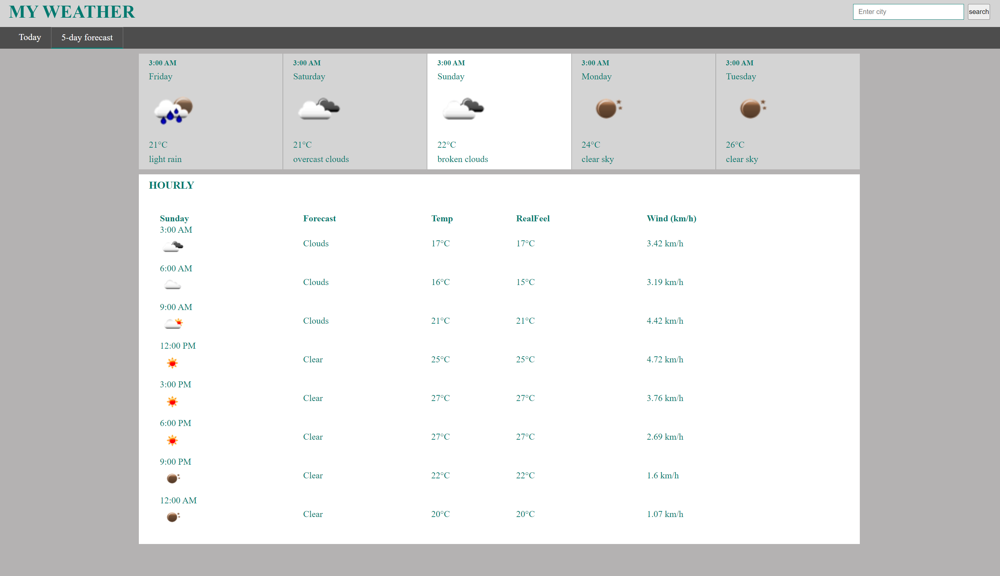

# Weather Forecast Web App

This is a weather forecast web application that provides users with current weather information and a 5-day weather forecast. The app uses the OpenWeather API to fetch weather data and displays it in an easy-to-read format. Users can search for weather information by city name and view detailed weather data for each day.

## Features

- Current weather display including temperature, weather description, and sunrise/sunset times.
- Hourly weather forecast for the current day.
- 5-day weather forecast with average temperature, real feel temperature, and wind speed.
- Interactive card interface for daily weather overview, click to view detailed forecast.
- Responsive design for optimal viewing on various devices.

## Technologies Used

- HTML, CSS, JavaScript for front-end development.
- OpenWeather API for weather data retrieval.
- Geolocation API to get the user's current location.
- Git for version control

## Getting Started

1. Clone the repository:
2. Navigate to the project directory: `git clone https://github.com/your-username/weather-forecast-app.git`
3. Open `index.html` in your web browser.

## Screenshots

